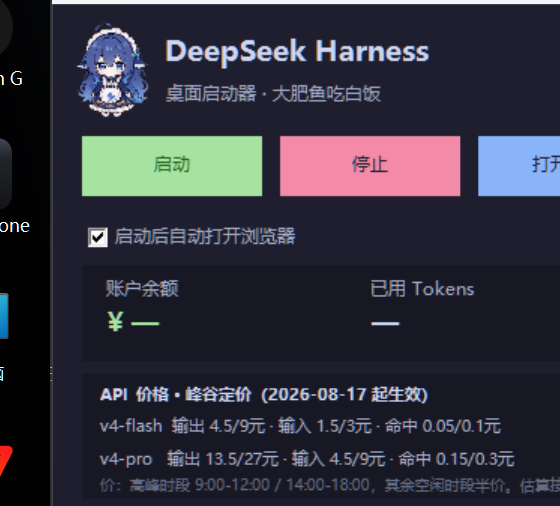

# DSH 桌面启动器

一个用于启动 / 停止 **DeepSeek Harness（DSH）** Web 界面的 Windows 桌面启动器（PowerShell + WinForms，无第三方依赖）。



## 功能

| 功能 | 说明 |
| --- | --- |
| 启动 / 停止 | 一键启停 DSH Web；「停止」会结束整个 DSH 进程树 |
| 认领外部实例 | 若 DSH 是外部脚本启动的，会自动**认领**该进程，使「停止」行为一致 |
| 状态指示 | 未检测 / 启动中 / 运行中 / 已停止，自动刷新（用 TcpClient 快速探测，不阻塞 UI） |
| **余额与用量面板** | 显示账户余额与已用 Tokens（输入 / 输出 / 缓存），约 10 秒自动刷新；「刷新」手动刷新，「充值 ↗」直达官方充值页 |
| **API 价格面板** | 显示 V4 Flash / Pro 的峰谷定价，并按当前余额估算两种模型还能输出的 token 量（按高峰价保守估算，括号内为空闲价） |
| 日志窗口 | 内置日志窗口只读末尾 300 行，实时增量刷新；「日志」按钮直接打开日志文件 |
| 自动开浏览器 | 服务就绪后自动打开**带 token 的地址** `http://127.0.0.1:3080/?token=...` |
| 桌面快捷方式 | 一键在桌面创建 `.lnk` |

## 文件

| 文件 | 说明 |
| --- | --- |
| `启动DSH.bat` | 双击运行入口（调用 `launcher.ps1`） |
| `launcher.ps1` | 启动器主程序（图形界面，约 900 行） |
| `usage.js` | 用量统计：查余额 + 汇总本地会话 token 用量（供界面调用） |
| `安装桌面快捷方式.ps1` | 在桌面创建「DSH 启动器.lnk」 |
| `制作图标.ps1` | 用一张 PNG 生成多尺寸 `.ico`（可选） |
| `docs/` | 文档与截图 |
| `logs/`、`dsh.pid` | 运行产物（首次运行自动创建，不入库） |

## 使用方法

1. **安装快捷方式**（可选，一次即可）：
   ```powershell
   powershell -NoProfile -ExecutionPolicy Bypass -File ".\安装桌面快捷方式.ps1"
   ```
2. **启动**：双击 `启动DSH.bat`（或桌面快捷方式），点击「启动」。
3. 服务就绪后会自动打开带 token 的地址 `http://127.0.0.1:3080/?token=...`。
4. **停止**：点击「停止」，会结束整个 DSH 进程树。
5. **关闭启动器窗口不会停止 DSH**，服务在后台继续运行（窗口标题会提示）。

## 配置

### 启动方式（二选一）

| 方式 | 设置 | 说明 |
| --- | --- | --- |
| ① 打包版 | `DSH_BIN` = `...\node_modules\@deepseek-ai\dsh\lib\bin.js` | 用 `node` 直接启动该 bin.js；`DSH_NODE` 可指定 node 路径（默认 `node`） |
| ② 源码目录 | 自动检测，或用 `-HarnessDir` / `DSH_HARNESS_DIR` 指定 | 在源码目录执行 `pnpm dsh web --no-open` |

DSH 源码目录的自动检测顺序：

1. 命令行参数 `-HarnessDir <路径>` 或环境变量 `DSH_HARNESS_DIR`
2. 正在运行的 DSH 进程命令行（最贴近实际）
3. 启动器所在目录向上逐级查找（含同级名字带 `harness` / `dsh` 的目录）

以上都找不到时，「启动」会提示需要显式指定。

### 其他环境变量

| 变量 | 用途 |
| --- | --- |
| `-Port <端口>` | Web 端口（默认 `3080`） |
| `DSH_HOME` | DSH 数据目录（不设置则用 DSH 自己的默认值） |
| `DSH_EXTRA_LOGS` | 额外的日志路径（多个用 `;` 分隔）；用于从外部启动实例的日志里提取带 token 的地址 |
| `DEEPSEEK_API_KEY` | 查余额用；默认从 `$DSH_HOME/.credentials.yaml` 读取，也可用环境变量 |

## 适配的 DSH 版本

本启动器在 **DSH `0.1.2-rc.1`（E 盘打包版）** 上开发与日常使用，源码 checkout（`0.1.2-alpha.1`）亦可正常工作。
核心逻辑只依赖「dsh web 会监听端口 + 把带 token 的地址写进日志」，对版本不敏感。

## 图标与素材

- **本仓库不含任何第三方角色美术**：仓库里只有代码，图标由 `制作图标.ps1` 或首次运行时本地生成。
- 如果你想给启动器加立绘/自定义图标：把 PNG 放进 `assets/`（该目录已加入 `.gitignore`，不会被提交），
  启动器会自动使用 `assets/icon.png`（窗口图标）与 `assets/front.png`（标题左侧立绘）；没有则退回默认样式。
- 自备素材的版权请自行确认。

## 关于本项目

- 本项目由 **AI（DeepSeek Harness）生成**，人类负责需求定义与验收。代码未逐字复制任何第三方项目。
- 社区有多个同类 DSH 启动器；本项目的实现、界面与用量/价格面板均为独立编写。

## License

MIT，见 [LICENSE](LICENSE)。
